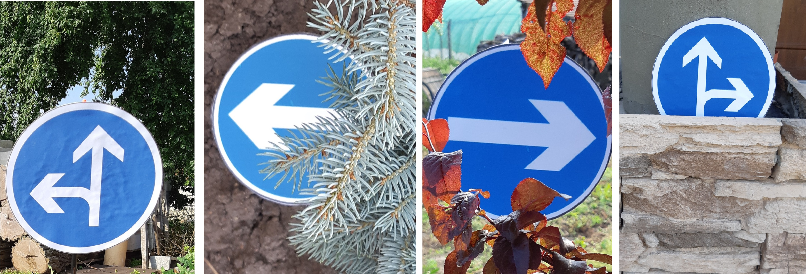

# Közlekedési táblák felismerése és osztályozása valós időben

### Feladat ###
Közlekedési táblák felismerése valós időben

### Környezet ###
Python futtatására alkalmas környezet (Windows 10 - 64bit), Python fordító program - Spyder (Python 3.6.5 64bit) , OpenCV 4.1.0 verzió.

### 1. Leírás ###
Ez a program közlekedési táblák felismerésére szolgál az OpenCV könyvtárat és a Python nyelvet használva.
Felismerhetö táblák:

### 2. Felismerés ###
  
  Kép előkészítése az OpenCV funkciók használatára
  - cv2.medianBlur filter alkalmazása zaj eltüntetése és élek elsimítása érdekében (így kissebb esélyel észlel a program hamis kör alakzatot)
  - cv2.cvtColor(frame, cv2.COLOR_BGR2GRAY) funkció alkalmazása - a kép átkonvertálása 8-bit single channel képpé ugyanis a cv2.HoughCircles
    funkció csak ilyenekkel tud dolgozni.

  Kör és kör köré írt hatszögek felismerése.
      A kör és hasonló alakzatok felismerését az OpenCV cv2.HoughCircles funkciója segítségével végezzük, mely kizárólag szürkeárnyalatos 
      képekkel tud dolgozni.
      
   Táblák felismerése
      A körök felismerése után a get_dominant_color funkció segítségével meghatározzuk, hogy a kör által lefedett területen mi a
      domináns szín.
      Ez által le tudjuk szükiteni a lehetséges táblákat ELSÖBBSÉGET SZABÁLYOZÓ táblákra (PIROS -> if dominant_color[2] > 100:) vagy
      UTASÍTÁST ADÓ jelzötáblákra (KÉK -> elif dominant_color[0] > 80:). 
      
Mivel a program az elsöbbséget adó táblák közül csupán a STOP táblát tudja felismerni, így ha a domináns szín 100 felett van, automatikan STOP táblát ismer fel a program. Ha a "elif dominant_color[0] > 80:" érvényesül, a program 3 zónára szegmentálja a kört. Ezen zónákon belül külön leelemzi a domináns színt, így meghatározvaa program által felismerhetö UTASÍTÁST ADÓ jelzötáblák fajtáját.
      
### 3. Lehetséges problémák ###

A felismerési módszer primitívsége miatt a program hajlamos a perspektívából és fényviszonyokból adódóan félreismerni bizonyos táblákat.
A tábla szegmentálási módszer általi felismerése tévesen ismerhet fel alakzatokat, hiányos, "defektív" táblákat bizonyos táblaként.
Példa: 

### 4. Tesztelés ###

A kód teszteléséhez otthon gyártott "jelzőtáblákat" használtam , amelyek így néztek ki:

- Arra számíthatnánk, hogy az ugyan azon, csak elforgatott vagy tükrözött jelzőtáblák felismerésének százaléka azonos lesz. 
  Az eltérést valószinűleg a tesztképek különbözősége okozza (perspektíva/fényviszonyok/fókusztávolság).

A teszteredmények az adott tesztcsoportra (120 kép, táblánként 20)

### 5. Javítások ###

- Median blur helyett Gaussian blur használata az élek megkímélése miatt (sokkal jobb lett a körök felismerésenek aránya)
- cv2.HoughCircles paramétereinek finomhangolása
- az összehasonlító zónák kalibrálása
- a software mostantól képes statikus képeket is felismerni (staticimage.py)
    - a staticimage.py a képeket egy fix vertikális 400 pixeles magasságra nagyítja/kicsinyíti , mindeközben ügyelve a képarányra.
      Az oka ennek, hogy a cv2.HoughCircles algoritmus fix paraméterekkel dolgozik. Így elkerülhető a különböző inputon bejövő képek
      nagyságából adódó hibás vagy nem felismerés.

